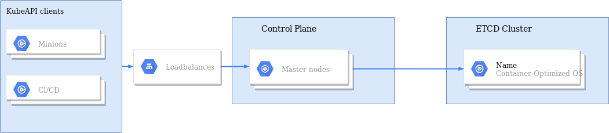

# Deploy a Production Ready Kubernetes 1.13 Baremetal Cluster

-   **Highly available** cluster
-   **ContainerD** runtime
-   **Weave** CNI
-   **CentOS 7** only

## Architecture

## Quick Start

To deploy the cluster you can use :

### Ansible

#### Usage

    # Copy ``example.yml`` as ``inventory.yml`` and modify it as you need
  
    # Deploy your cluster
    ansible-playbook -i inventory.yml deploy_cluster.yml

    # Upgrade your cluster
    ansible-playbook -i inventory.yml cluster_upgrade.yml

**Requirements:**
  - Ansible 2.8
  - You need servers with at least 4 CPUs for ETCD nodes
  - All your nodes should have valid FQDNs as defined in inventory file
  - You need to have valid FQDN for `kube_loadbalancer_fqdn` variable

**Variables:**

  - `coredns_service_ip:` IP address of CoreDNS Kubernetes service. Default `172.30.0.10`
  - `coredns_version:` version of CoreDNS. Default `1.5.0`
  - `etcd_group_name:` inventory name of ETCD group. Default `etcd`
  - `ingress_version:` version of Nginx INC. ingress controller. Default `1.4.6`
  - `kube_bootstrap_token:` Kubernetes bootstrap token. Default `a90d81632f0d19718e2d24ab1d4df117`
  - `kube_crt_country_name:` country name of certificate (C). Default `KZ`
  - `kube_crt_expire_date:` certificate expire date in ASN1 TIME format. Default `20291231235959Z`
  - `kube_crt_locality_name:` locality name of certificate (L). Default `Almaty`
  - `kube_crt_organizational_unit_name:` organization unit name of certificate (OU). Default `Kubernetes`
  - `kube_crt_organization_name:` organization name of certificate (O). Default `Aviata LLC`
  - `kube_crt_start_date:` certificate start date in ASN1 TIME format. Default `20190101000001Z`
  - `kube_crt_state_or_province_name:` state or province name of certificate (ST). Default `Almaty`
  - `kube_encryption_key:` Kubernetes encryption key. Default `"Aeb0eNp576qMFof+m2GsCW1Nti2gPeoJeNd5ca+2RYI="`
  - `kube_loadbalancer_fqdn:` loadbalancer FQDN name. Default `lb.cloud.example.com`
  - `kube_pod_ip_range:` CIDR for pods network. Default `10.32.0.0/12`
  - `kube_service_cluster_ip_range:` network CIDR for Kubernetes services. Default `172.30.0.0/24`
  - `kube_service_ip:` IP address of Kubernetes service. Default `172.30.0.1`
  - `kube_gid:` Linux group ID for pods runAsGroup securityContext. Default `2000`
  - `kube_uid:` Linux user ID for pods runAsUser securityContext. Default `2000`
  - `kube_version:` version of Kubernetes components. Default `1.13.0`
  - `loadbalancers_group_name:` inventory name of Kubernetes loadbalancers group. Default `loadbalancers`
  - `masters_group_name:` inventory name of Kubernetes masters group. Default `masters`
  - `metrics_server_version:` version of Metrics Server. Default `0.3.6`
  - `weave_password:` encryption password of Weave CNI. Default `06d3d0d67ca38a0925f7d2a7881d85ed5ff90173528f1daa7fa632ba832403ef5915cfbe2c87605c87209dc2eda1f2aa9e2fc9deb4a754904867eca1d5642b50cab144bbc1fc5be1d1868ccbe2ecac6c9aa13f9d8c4f6018e64c5156e95657c86c4fe4b365797bf9305caeb9a304c8b439ae7a3bd9730c4eaf64fd515cdd9b3c`
  - `weave_version:` version of Weave CNI. Default `2.5.1`
  - `workers_group_name:` inventory name of Kubernetes workers group. Default `nodes`

**Notes:**

  - You should generate `kube_bootstrap_token` by `head -c 16 /dev/urandom | od -An -t x | tr -d ' '` command
  - You should generate `kube_encryption_key` by `head -c 32 /dev/urandom | base64` command
  - You should generate `weave_password` by `openssl rand -hex 128` command
  - Tested only on DigitalOcean droplets

**WARNINGS:**
  - Don't run `cluster_upgrade.yml` for major Kubernetes upgrades
